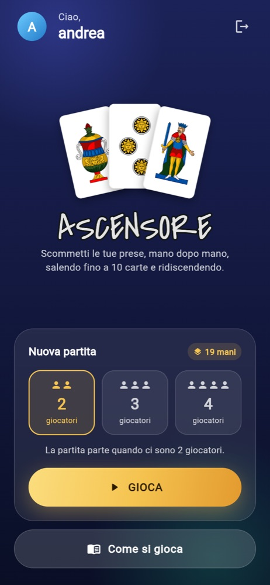
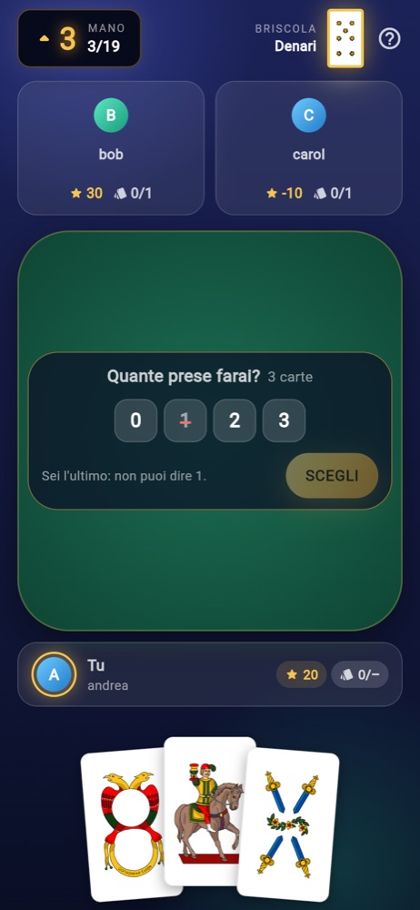
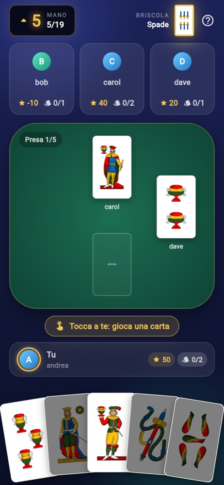
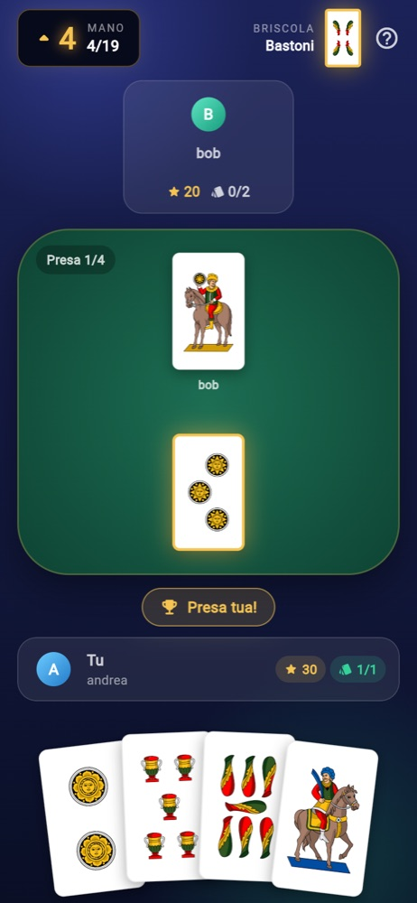
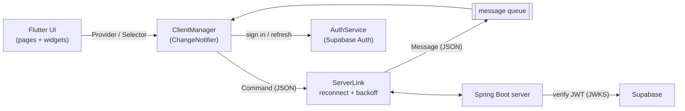

# Ascensore — Multiplayer Card Game (Flutter Client)

Real-time multiplayer client for **Ascensore**, a traditional Italian trick-taking card game, built with **Flutter** and talking to a **Java / Spring Boot** game server over **WebSockets**.

<p align="center">
  
  
  
  
</p>

## The game

Played with a 40-card Italian deck by 2–4 players. The hand size goes **up from 1 to 10 cards and back down to 1** — like an elevator (*ascensore*), 19 sets in total.
At the start of every set each player **bets exactly how many tricks they will take**; the last player to bet cannot make the bets add up to the number of tricks, so someone always misses. The trump suit (*briscola*) changes every set.

## Features

- **Real-time multiplayer** over a persistent WebSocket connection; runs on Android, iOS and the web
- **Authentication with Supabase** (email/password, PKCE flow); the access token is sent to the game server, which verifies it independently
- **2, 3 or 4 players** — pick the match size in the menu; a waiting room shows who has joined and the free seats, and you can leave the queue
- **Public nicknames** — players choose a unique nickname on first login; the email address is never shown to other players
- **Automatic login** — the session is restored and refreshed on app start
- **Reconnection** — a dropped connection is retried with backoff while a banner shows the state; the server keeps the seat for 60 seconds and replays the table (hand, briscola, bets, tricks, cards on the table, whose turn it is)
- **Server-authoritative state** — the client never changes game state optimistically; it validates moves locally for instant feedback (must follow suit, last-bidder constraint) and applies only what the server confirms
- **Elevator floor indicator** — the current hand size with its direction of travel and the set number (e.g. *5 ▲, 5/19*)
- Tap-to-lift or drag-and-drop cards; cards you may not play (you must follow the lead seed) are dimmed
- Betting happens on the table itself, with your hand in view below; the one bet the last player may not make is crossed out
- The trick winner's card glows before the table is cleared; points won or lost pop up at the end of each set
- Rules sheet in-app; responsive layout for phones, tablets and desktop browsers

## Roadmap

- **Special abilities** *(planned)* — power-up cards that let players make special moves during a game:
  - **Swap** *(Uno-style reverse card)* — exchange your hand with another player's
  - **Joker** — play a card with a value of your choice

## Architecture



- **Ordered message queue** — server messages are applied strictly in arrival order. After a trick or a set the queue pauses for a few seconds so players can see the cards; messages that arrive meanwhile wait instead of being applied early or out of order, and logging out cancels the pause cleanly.
- **Connection is not session** — `ServerLink` owns the socket and reconnects with backoff when it drops; every new connection identifies the player again, which is also how the server resumes a match. Only an explicit logout (or a refused token) signs the player out.
- **Command / message protocol** — the client sends intentions (`SET_BET`, `PUT_CARD`, …) with no player name in them (the server knows who is on the socket); every server event is decoded by a registry in `server_message.dart` into a class that applies itself to the state. The wire format is documented in the server repository (`docs/protocol.md`).
- **Testable seams** — the socket (`GameConnection`) and Supabase (`AuthService`) sit behind interfaces, so `ClientManager` is tested with fakes in fake time: login and nicknames, trick and set pauses, reconnection mid-match, logout during a pause.
- **Contract test against the real server** — `test/fixtures/real_match.jsonl` holds every message the real server sent to two players during a full match, including a dropped connection and the reconnection; both players' clients replay it and must end on the server's final scores.

- **Design system** — colours, radii and component themes live in `lib/ui/theme.dart`; reusable pieces (glass panels, buttons, avatars, cards, the floor indicator) in `lib/ui/`. The game screen is split into small widgets under `lib/pages/game/`.

```
lib/
├── ui/        # theme and shared components
├── auth/      # AuthService (Supabase)
├── network/   # GameConnection (WebSocket), ServerLink (reconnection)
├── command/   # client → server commands
├── message/   # server → client messages and their decoders
├── model/     # game state, players, cards, rules
├── pages/     # screens
└── widgets/   # reusable UI components
```

## Running

```bash
flutter run --dart-define=SERVER_URL=wss://your-server/ws
```

Without `SERVER_URL` the app connects to a local server (`ws://localhost:8080/ws` on the web, `ws://10.0.2.2:8080/ws` from the Android emulator).

```bash
flutter test
```

**Design preview** — every screen with scripted data, no server or account needed (the screenshots above come from it):

```bash
flutter run -d chrome -t tool/design_preview.dart
```

Pick a screen with the `s` query parameter: `?s=login`, `nickname`, `menu`, `waiting`, `bet`, `bet10`, `play`, `trick`, `peak`, `setresult`, `gameover`, `reconnecting`.

## Known limitations

- The interface is in Italian only; it is not localized yet.
- If a player leaves a match for good, the match ends for everyone (a server-side rule for now).

## Tech stack

- **Client:** Flutter · Dart · Provider · WebSockets · Supabase Auth
- **Server** (separate repository): Java 17 · Spring Boot · PostgreSQL (Supabase)
