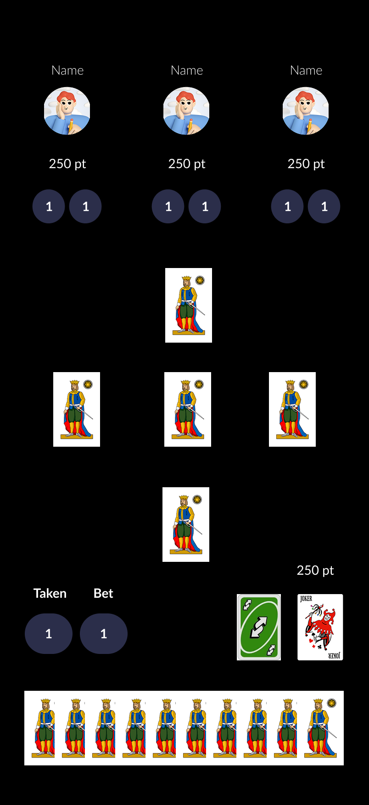
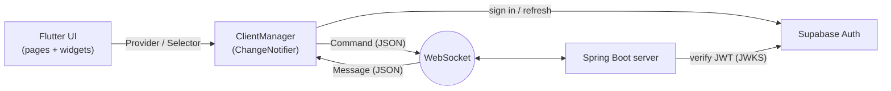

# Ascensore — Multiplayer Card Game (Flutter Client)

Real-time multiplayer client for **Ascensore**, a traditional Italian trick-taking card game, built with **Flutter** and talking to a **Java / Spring Boot** game server over **WebSockets**.

<p align="center">
  
  <br>
  <em>Game screen — UI design mockup (Figma)</em>
</p>

## The game

Played with a 40-card Italian deck by 2–4 players. The hand size goes **up from 1 to 10 cards and back down to 1** — like an elevator (*ascensore*), 19 sets in total.
At the start of every set each player **bets exactly how many tricks they will take**; the trump suit (*briscola*) changes every set.

## Features

- **Real-time multiplayer** over a persistent WebSocket connection
- **Authentication with Supabase** (email/password, PKCE flow); the JWT is sent to the game server, which verifies it independently
- **Automatic login** — the session is restored and refreshed on app start
- **Reconnection** — a player who drops mid-game rejoins with the full game state restored
- **Server-authoritative state** — the client never mutates game state optimistically; it validates moves locally (must follow suit, last-bidder constraint) and waits for the server to confirm
- Drag-and-drop cards, bet slider, animated trick and set results
- Multiple rematches without restarting the app

## Roadmap

- **Special abilities** *(planned)* — power-up cards that let players make special moves during a game, shown in the mockup above:
  - **Swap** *(Uno-style reverse card)* — exchange your hand with another player's
  - **Joker** — play a card with a value of your choice

## Architecture



- **Command / Message protocol** — every client action (`PutCard`, `SetBet`, `JoinGameRequest`, …) is a `Command`; every server event (`HandUpdate`, `PlayedCardUpdate`, `EndSetUpdate`, …) is a `Message`. Both are serialized to JSON and mirror the class hierarchy on the server, so adding a new interaction means adding one class on each side.
- **Executable messages** — each incoming message implements `ExecutableInClient` and applies itself to the client state, keeping the dispatch loop small.
- **Single source of truth** — `ClientManager` holds the game model and notifies the UI; `AppWrapper` switches screens (login → menu → game → game over) from a single `AppScreenState` enum.
- **Pure, tested game rules** — move validation lives in `GameRules`, independent of Flutter widgets, and is covered by unit tests (`flutter test`).

```
lib/
├── command/   # client → server actions
├── message/   # server → client events
├── model/     # game state, players, cards, rules
├── pages/     # screens
└── widgets/   # reusable UI components
```

## Tech stack

- **Client:** Flutter · Dart · Provider · WebSockets · Supabase Auth
- **Server** (private repository): Java 17 · Spring Boot · PostgreSQL (Supabase)
